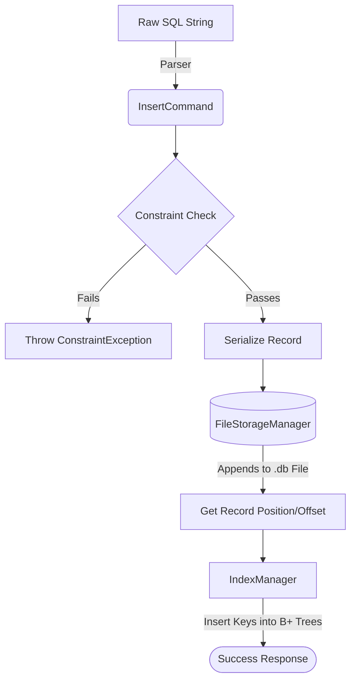
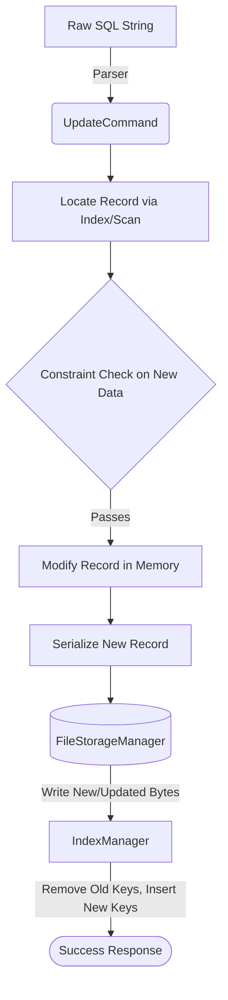
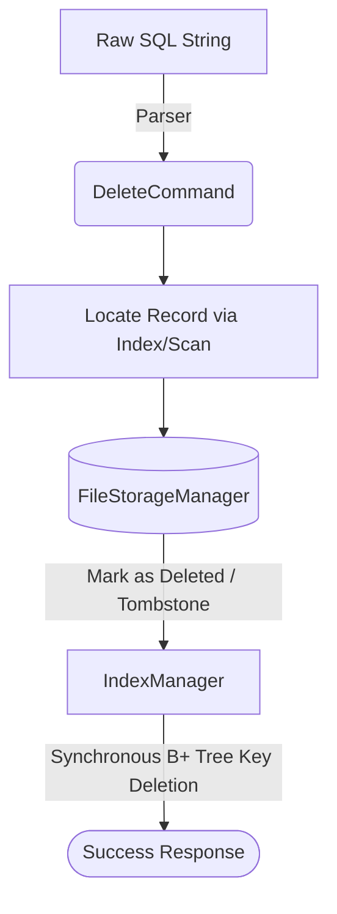
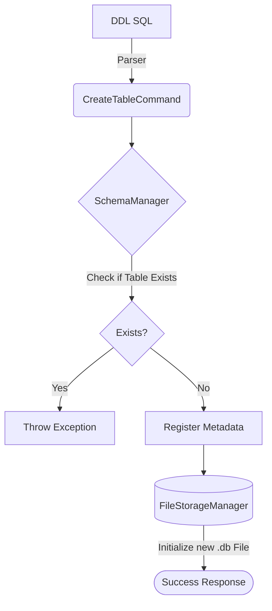
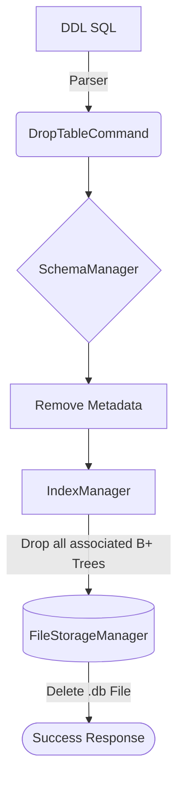
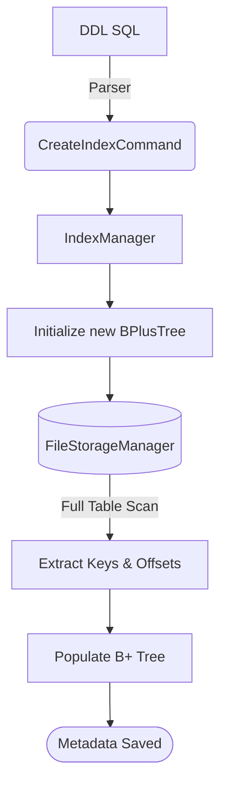
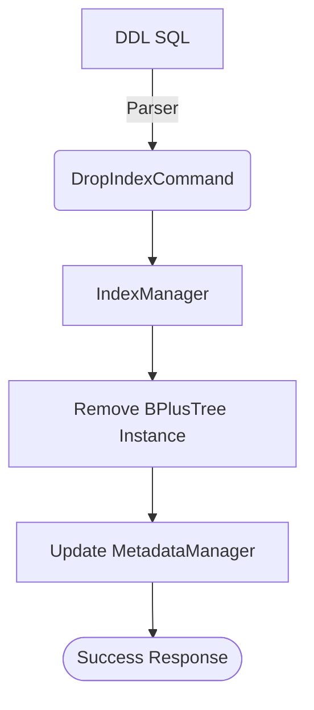
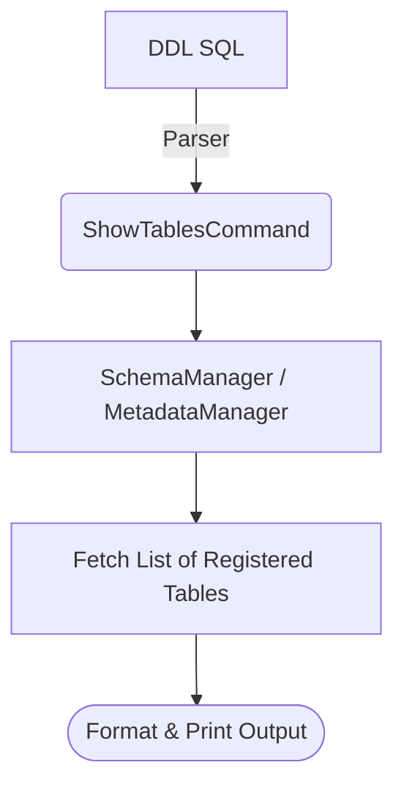

# NovaDB

NovaDB is a custom-built, lightweight Relational Database Management System (RDBMS) implemented in Java. It provides core relational database capabilities, including SQL parsing, a custom binary storage engine, B+ Tree-based indexing, schema and constraint management, and foundational concurrency and caching mechanisms.

## 1. System Architecture & Core Subsystems

### 1.1. File System & Persistence (`FileStorageManager`)
NovaDB ensures data persistence by writing records directly to binary `.db` files located in the `database/tables/` directory.
- **Serialization**: Each row is conceptualized as a `Record` object containing sequential `Cell` objects. `RecordSerializer` converts these to byte arrays, prefixed by their length, and writes them contiguously.
- **Page & Buffer Management**: To decouple disk I/O from query processing, NovaDB uses a `BufferPool` that manages memory pages and frames, employing LRU caching strategies.
- **Durability**: By appending data to the binary files and managing file offsets, NovaDB guarantees that committed data remains persistent across database restarts.

### 1.2. B+ Tree Indexing (`index`)
To achieve `O(log N)` search times, NovaDB features an in-house generic `BPlusTree<K, V>` implementation.
- **Structure**: The B+ Tree consists of `InternalNode` and `LeafNode` structures, automatically handling node splitting, merging, and overflow across disk/memory. 
- **Non-Unique Indexes**: The implementation supports multi-value buckets for non-unique indexes, allowing multiple record positions for a single key.
- **Index Synchronization**: During DML operations (INSERT, UPDATE, DELETE), the `QueryEngine` synchronously updates the B+ Tree. Keys map directly to physical record positions (integer offsets) in the binary `.db` files.

---

## 2. Diagrammatic Query Workflows

Below are the detailed, step-by-step diagrammatic representations of how every query command is implemented and executed in NovaDB.

### 2.1. Data Insertion (`INSERT`)


**Implementation Details:** 
- The query passes through the `SQLParser`. 
- `QueryEngine` strictly enforces `NOT NULL`, `UNIQUE`, and `FOREIGN KEY` constraints prior to disk access.
- `FileStorageManager` takes the serialized record bytes and appends them to disk, returning the integer offset.
- `IndexManager` uses this offset to insert new nodes into the relevant `BPlusTree` instances.

### 2.2. Data Retrieval (`SELECT`)

```mermaid
flowchart TD
    A[Raw SQL String] -->|Parser| B(SelectCommand)
    B --> C{Query Optimizer}
    C -->|WHERE on Indexed Col| D[ExecutionPlan.INDEX_SCAN]
    C -->|No Index Available| E[ExecutionPlan.TABLE_SCAN]
    D --> F[B+ Tree Search]
    F -->|O(1) amortized disk I/O| G[(FileStorageManager)]
    E -->|Sequential Read| G
    G --> H[Memory Buffer / LRU Cache]
    H --> I[Apply Filters & Joins]
    I --> J([Result Set])
```
**Implementation Details:**
- The `QueryOptimizer` evaluates the `SelectCommand` to decide the best `ExecutionPlan`.
- If an index exists for the `WHERE` clause, it queries the `BPlusTree` to fetch physical record offsets.
- Records are loaded through the `BufferPool` to minimize direct disk I/O, filtered, and returned to the client.

### 2.3. Data Modification (`UPDATE`)


**Implementation Details:**
- Locates the existing record and validates constraints on the updated fields.
- Due to binary append-only or direct offset writing mechanics, the storage manager updates the data on disk.
- **Critical Step:** `IndexManager` synchronously removes the old key-value pairs from the B+ Tree and inserts the updated keys to prevent stale index corruption.

### 2.4. Data Deletion (`DELETE`)


**Implementation Details:**
- The engine finds the targeted records.
- Records in the binary file are logically marked as deleted (e.g., via tombstones) to prevent shifting offsets, which would invalidate all other index pointers.
- `IndexManager` immediately removes the keys from the B+ Tree.

### 2.5. Table Creation (`CREATE TABLE`)


**Implementation Details:**
- Registers table schema, constraints, and column definitions in `MetadataManager`.
- `FileStorageManager` creates a fresh, empty `.db` file in the `database/tables/` directory to prepare for incoming records.

### 2.6. Table Deletion (`DROP TABLE`)


**Implementation Details:**
- Removes the table's structural definition.
- Cascades the deletion to the `IndexManager` to wipe all associated B+ Trees.
- Physically deletes the `.db` file from the disk.

### 2.7. Index Creation (`CREATE INDEX`)


**Implementation Details:**
- Initializes a new `BPlusTree<K, V>` instance.
- Forces a one-time full table scan via `FileStorageManager` to extract the target column values and their physical record offsets.
- Populates the tree and saves the index metadata.

### 2.8. Index Deletion (`DROP INDEX`)


**Implementation Details:**
- The engine identifies the targeted index, removes its in-memory and on-disk representations, and clears it from the metadata registry.

### 2.9. Viewing Tables (`SHOW TABLES`)


**Implementation Details:**
- Simply queries the `MetadataManager` for all loaded schemas and displays them to the client (typically via `NovaShell`).

---
## Getting Started
- **Entry Point:** The main CLI entry point is `cli.NovaShell`.
- **Storage Path:** Database files are stored inside the `database/` directory.

*(For a more detailed technical breakdown, refer to `NovaDB_Architecture.md`)*
